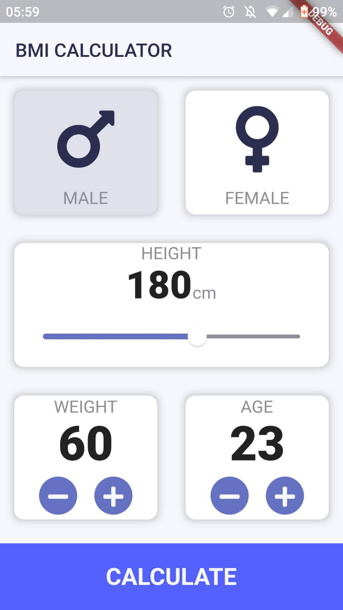

# BMI calculator

I was joining a Udemy course about dart and flutter, and in one of their lessons, we made this BMI calculator. I think this app is one of my most beautiful UI designs.
in this app I learn:
  - How to layout widgets in Flutter
  - Learn about functions
  - Learn about encapsulation and modularization

